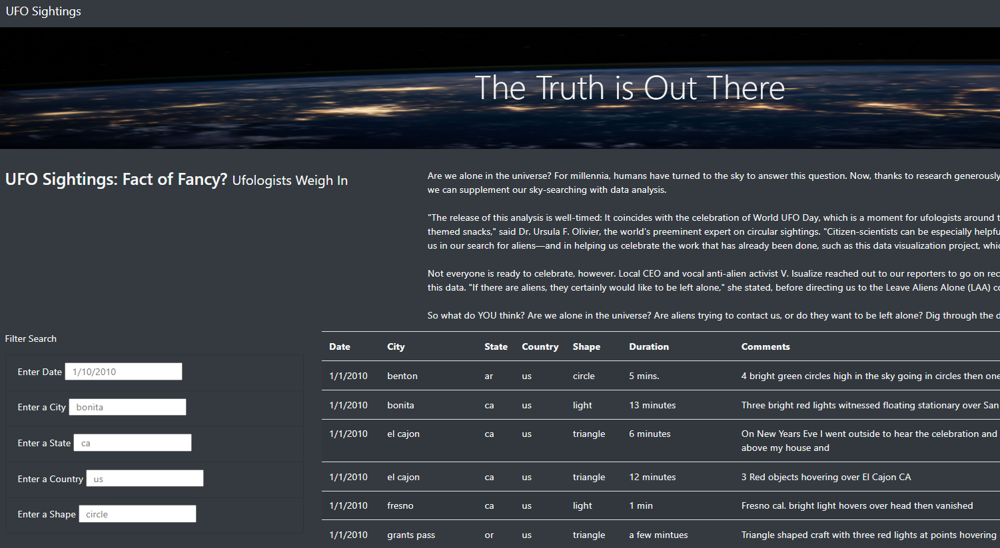
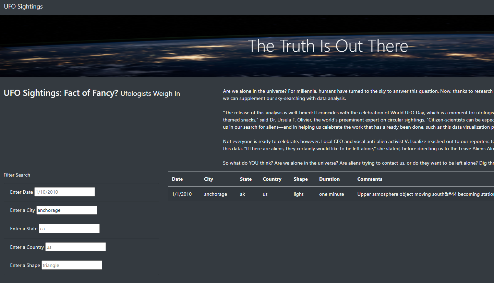

# UFOs

## Overview:
The purpose of this project was to create a webpage with information about UFO sightings. At the bottom of this page, is a table that can be filtered using the a date, city, state, country, and shape input by the user.

## Results:
This is what the page currently looks like.

To filter the table at the bottom of the webpage, simply type in the criteria you with to filter. The results of typing in *anchorage* in the city table are below.

## Summary:

This website has been updated to add more filters for inquiries to the table. city, state, country, and shape filter options have been added. A drawback of this design is that the filters are case sensitive, so adding a capital letter will not bring up the results the users are looking for.

### Recommendations for further website development:
- When the filters are used, a number should pop up showing how many entries fit the criteria. 
- The date filter only accepts the date formatting show in these parenthesis (1/10/2012). In order to help correct any user mistakes, a small calender icon could be added that expands when clicked so the user can select a date that will autofill the correct way.
